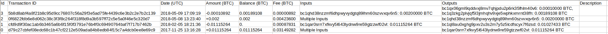

# Bitcoin CSV Generator

This program generates a `.csv` file containing all Bitcoin transaction data for a specific wallet. Simply provide the transaction hashes of all wallet transactions and a list of addresses associated with your wallet (or at least the addresses that have been used so far), as described below. The generated file provides a structured overview of your transaction history, making it easier to analyze your activity and handle tax reporting.

Output example:



This is the raw CSV file content of the example output mentioned above:

```
Id,Transaction ID,Date (UTC),Amount (BTC),Balance (BTC),Fee (BTC),Inputs,Outputs,Description
3,5b8d8abf4a8f21b8c95d9cc76807c56a29f3e5ad75fe4439c6e3b2c2e7b2c139,2018-05-09 17:09:19,-0.00010892,0.00189108,0.00000892,bc1qhd38nzzmf6dhpwyvydgtq89lhm60szvvxqv6n5: 0.00200000 BTC,"bc1qx06gml9qddvxj8mv7qhjpdu2p6rk35fhlm40v6: 0.00010000 BTC,
bc1q3zkg2plvjqf5l3jmhqhv9xje5wphkxmrnt38fh: 0.00189108 BTC",
2,0f6822fdb6e8d062c38c3f3f8c264f318f8d9a3b597ff72c5e5a0f46e5c320d7,2018-05-08 13:23:40,+0.002,0.002,0.00423600,Multiple Inputs,bc1qhd38nzzmf6dhpwyvydgtq89lhm60szvvxqv6n5: 0.00200000 BTC,
1,cfd9d9f30ac1ab6b3465a6b6f15f0f3791e76b4f0c69490764baf7f717b7462b,2018-02-05 18:21:36,-0.01115264,0.,0.00087831,bc1qar0srrr7xfkvy5l643lydnw9re59gtzzwf02vl: 0.01115264 BTC,bc1ql8au0xghg9pxv2u3s2m7y5z5lcdfscyx7f6zsd: 0.01027433 BTC,
0,d79c27cbfef08edc68c1b47cf2212e509ada84b8edb84f15c7a4dcb0ee8e69c9,2017-11-25 13:16:28,+0.01115264,0.01115264,0.03149282,Multiple Inputs,bc1qar0srrr7xfkvy5l643lydnw9re59gtzzwf02vl: 0.01115264 BTC,
```

In order to get the addresses of your Electrum wallet, you can execute the following in the Electrum Console:

```
listaddresses()
```

If you're using a different wallet, the process may vary, but you can usually find a similar option in the wallet's console or interface. If not, manually copying and pasting the addresses might be the best option.

Next, replace the contents of `data/addresses.txt` with your addresses, ensuring you use the same format as shown in this example:

```
bc1q864saq57q6807yr49hvdln672d2yhm3lk7nd7g
bc1qdkwrhlgegt74rl2pgy5qsdxtdf7xe9fpxrm6kq
bc1qfljxuh8cxmgqujv8cprtffnq89kd3k2etkq8nt
```

To get the transaction hashes from your Electrum wallet, follow these steps:

```
Electrum
-> History
-> At the top right corner click the "tools" looking icon
-> Export
```

If you're using a different wallet, the process may vary, but you can usually find a similar option in the wallet's console or interface. If not, manually copying and pasting the transaction hashes might be the best option.

Next, replace the contents of `data/transaction-ids.txt` with your transaction hashes, ensuring you use the same format as shown in this example:

```
afbe2585d2ce72664dfe3c4e55df82d2a9e87f7c0307b53da8c44cda7a546103
1a005995d29d7be81fd18dbc9fb9f9599b8c509033b72d573b0c036e52d77cfd
```

If none of your addresses are included in the inputs of a transaction, the input field for that transaction will be set to "Multiple Inputs" or "Input". Otherwise, the inputs associated with your addresses will be displayed.

If none of your addresses are included in the inputs of a transaction, the output field for that transaction will only display outputs associated with your addresses. Otherwise, all outputs will be displayed.

There are generally two ways to execute this program.

You can use Docker (the recommended approach) by installing Docker Desktop and running the following commands in the root directory of this project:

```bash
docker build --target production -t bitcoin-csv-generator .
docker run -it -v $(pwd)/output:/usr/src/app/output bitcoin-csv-generator
```

Alternatively, you can install Node.js and pnpm on your system, then run the following commands:

```bash
pnpm install
pnpm start
```

In both cases, the generated `.csv` file will be located at output/transactions.csv.

If this program saved you a ton of time, please consider donating. Your contribution would mean a lot to me, I'd appriciate it so much.

My cryptocurrency addresses are as follows:

Bitcoin (BTC):

1CYACQBKztsZha8Ea3ze9CmjZYfGRHMTox


Thank you so much.
